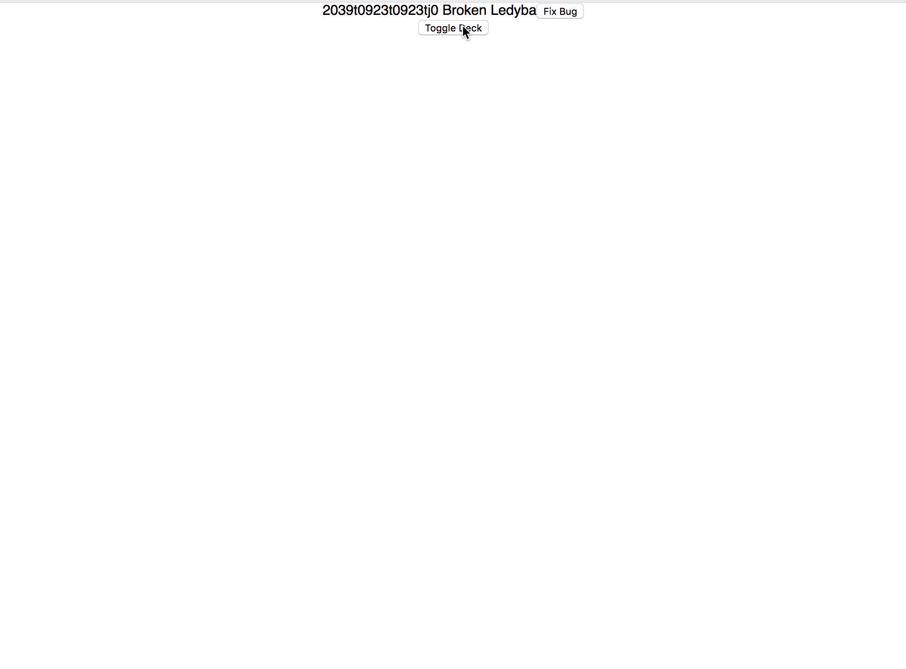

# Optimistic Response Bug
If a mutation with optimistic response gets triggered while an initial query is loading the component with the query receives an invalid data state. (loading: false, error: undefined, query data: undefined)
## Reproduce
1. Wait until initial bug query is loaded
2. Press »Toggle Deck«
3. Press »Fix Bug« while deck query is in progress

